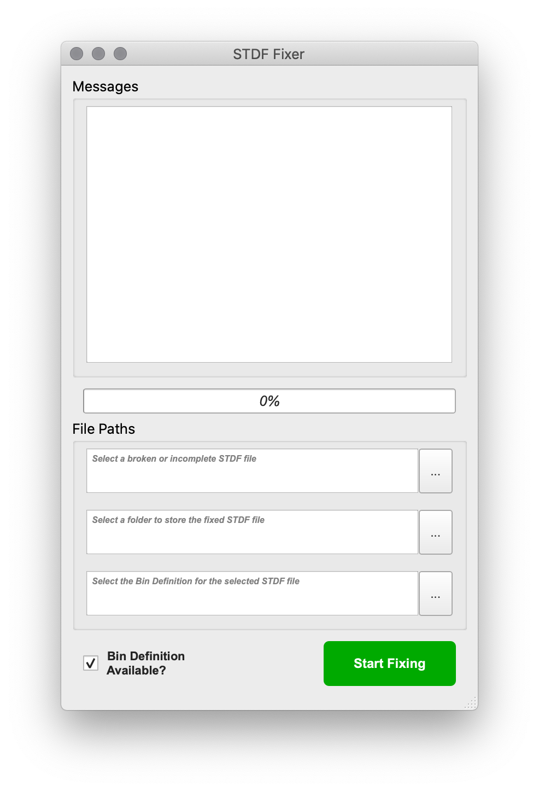

# STDF Fixer 

STDF Fixer is a tool to analyze STDF V4 (Standard Test Data Format) file and append missing summary records.

***Note**: STDF Fixer is only tested with STDF tmp files generated from NI TestStand, may not compatible with other ATE vendors, see below for more information about data of generated records*

---

## Usage

Run the released application (or MainWindow.py in src folder, python 3.7 and PyQt5 requird) and then:
- Select the STDF file to be fixing.
- Select the output folder.
- Select the Bin Definition of the corresponding STDF file.

The original STDF tmp file is untouched, the fixed STDF will be put in the assigned output folder with the filename "OriginalName_Fix@timestamp.std"

***Note**: Bin Definition is a xml that used by NI Teststand semiconductor module to store the info of hardware bins and software bins, it's important for generating **HBR** and **SBR** with correct BIN_NAM and BIN_PF. Absent of Bin Definition will result in empty BIN_NAM and possibly incomplete HBR/SBR records*

---

## What Records will be generated?
***Note**: Field names not shown in the context are set to invalid/missing value*
### **1. PRR (only if #PIR ≠ #PRR)**
If PIR count is greater than that of PRR, a PRR would be appended first with data:

- **HEAD_NUM**: same as the last PIR

- **SITE_NUM**: same as the last PIR

- **PART_FLG**: 0b00011100 (Failed DUT)

- **NUM_TEST**: Count of PTR, FTR and MPR since the last PIR

- **TEST_T**: 0

- **PART_ID**: Count of PIR

---

### **2. WRR (only if #WIR ≠ 0 and #WIR ≠ #WRR)**

- **HEAD_NUM**: same as the last WIR

- **SITE_GRP**: same as the last WIR

- **FINISH_T**: same as START_T of the last WIR

- **WAFER_ID**: same as the last WIR

- **PART_CNT**: Count of PIR since the last WIR

- **GOOD_CNT**: Count of passed PRR since the last WIR

---

### **3. TSR (site summary and overall summary)**
- **HEAD_NUM**: same as PTR/FTR/MPR for site summary, 255 for overall summary

- **SITE_NUM**: same as PTR/FTR/MPR 

- **TEST_NUM**: same as PTR/FTR/MPR 

- **TEST_NAM**: same as PTR/FTR/MPR 

- **TEST_TYP**: P or F or M

- **EXEC_CNT**: Count of PTR/FTR/MPR of same TEST_NUM (overall) in one site (site)

- **FAIL_CNT**: Count of Passed PTR/FTR/MPR of same TEST_NUM (overall) in one site (site)

---

### **4. HBR & SBR (site summary and overall summary)**

- **HEAD_NUM**: same as PRR for site summary, 255 for overall summary

- **SITE_NUM**: same as PRR

- **BIN_NUM**: read from PRR or Bin Definition

- **BIN_NAM**: "" or read from Bin Definition

- **BIN_PF**: P/F based on PART_FLG or read from Bin Definition

- **BIN_CNT**: Part counts of the same BIN_NUM from PRR (overall) in one site (site)

---

### **5. PCR (site summary and overall summary)**
- **HEAD_NUM**: same as PRR for site summary, 255 for overall summary

- **SITE_NUM**: same as PRR

- **PART_CNT**: Counts of PIR

- **GOOD_CNT**: Counts of passed PRR

---

### **6. MRR**
- **FINISH_T**: START_T from MIR + total test time in all PRR

